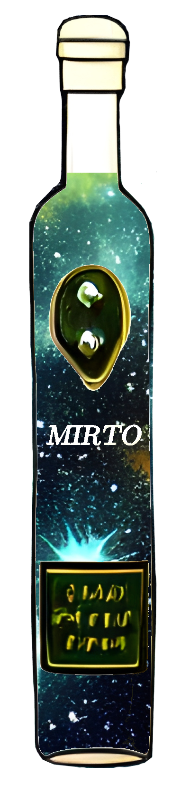

# MIRTO: Mock Interferometry Radio Telescope Observations
This code includes a collection of key Python scripts for creating Mock Interferometry Radio Telescope Observations (MIRTO). I use this code to simulate SKA-Low and MWA observations (fixed pointing) for 21-cm EoR simulations, but the visibility calculation is agnostic to the observing system. 

    <a name="logo"></img></a>

<i>Not to be confused with [Mirto (liqueur)](https://en.wikipedia.org/wiki/Mirto_(liqueur)) </i>

- [Interferometry and Synthesis in Radio Astronomy (Thompson, A. Richard Moran, James M. Swenson, George W.)](https://library.oapen.org/handle/20.500.12657/28044)
