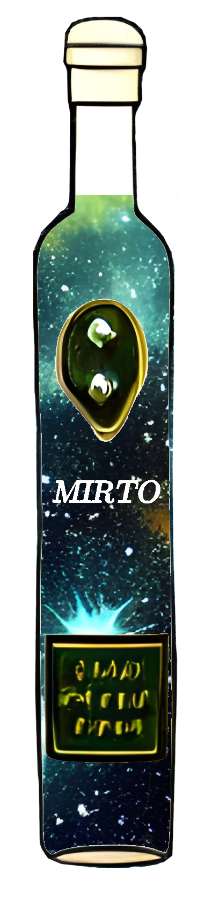

# MIRTO: Mock Interferometry Radio Telescope Observations
A collection of python scripts for creating Mock Interferometry Radio Telescope Observations (MIRTO)

    <a name="logo"></img></a>

<i>Not to be confused with [Mirto (liqueur)](https://en.wikipedia.org/wiki/Mirto_(liqueur)) </i>
